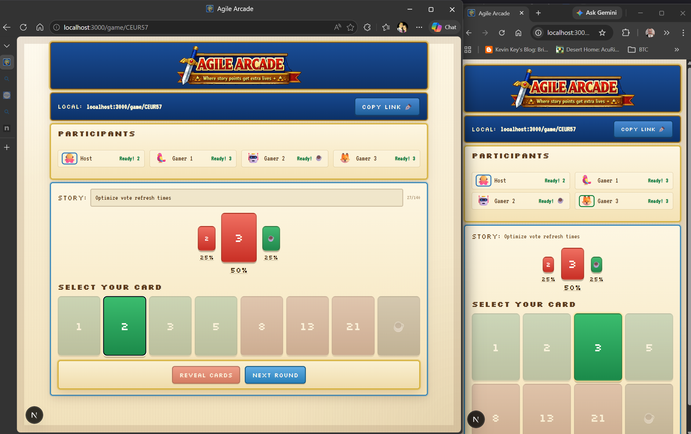

<p align="center">
  
</p>

<p align="center">
  Real-time story pointing game for teams — no accounts, no friction, more fun.
</p>

<p align="center">
  <a href="https://github.com/Dillie-O/agile-arcade/actions/workflows/ci.yml"></a>
  <a href="LICENSE"></a>
</p>

<p align="center">
  
</p>

<p align="center">
  <a href="CHANGELOG.md">Change Log</a> | <a href="https://agile-arcade.onrender.com/" target="_blank">Demo Site</a>
  <br/>(Patience, it may take a moment to come online... 🤓)
</p>

---

## Hello!

Yes, this is "yet another agile poker planning" tool out there but it was a fun "train hacking" excursion for me and was inspired by a team lead commenting how they were "paywalled" on a "free" tool after "too much use". I hope it helps you too! It's designed to be very low friction and self hosted so you can fire it up on demand or leave it running on your internal server with minimal resources.

Please feel free to submit issues, pull requests, or even fork your own! I can't guarantee I'll get things merged quickly but am open to making the tool better.

## Features

- **Instant rooms** — Start a game, get a room and share the link, no sign-up required
- **Host controls** — reveal votes, reset rounds, add a story title or URL, which will provide a link for others to view.
- **Responsive** - Primarily designed for desktop use, but enough care and tweaking that you could participate from a phone or smaller browser window.
- **Hidden voting** — votes stay concealed until the host reveals; everyone sees results at the same time.
- **Fibonacci & T-Shirt decks** — choose the scale that fits your team
- **Shareable tunnels** — built-in ngrok integration so you can invite remote participants while hosting on your machine
- **Retro terminal UI** — Zelda-inspired aesthetic with emoji avatars, no login required
- **Single container** — Next.js frontend + Socket.IO backend run in one Node process
- **Auto host promotion** — if the host disconnects, the next participant is promoted automatically

---

## Quick Start

### Local dev

```bash
npm install
npm run dev
```

Open [http://localhost:3000](http://localhost:3000). Open a second tab to join as a second participant.

### Docker

```bash
docker compose up --build
```

---

## Deployment

The app ships as a single Docker image and works with any container hosting platform. Fork the repo, connect it to your preferred service (a few examples below), and it builds and runs automatically.

| Platform | How to deploy |
|---|---|
| **Render** | New Web Service → Docker → point to your repo |
| **Railway** | Connect GitHub repo → Railway auto-detects the `Dockerfile` |
| **Fly.io** | `fly launch` in the project root, then `fly deploy` |
| **VPS / self-hosted** | `docker compose up -d` |

> **Note:** Deploy as a **single instance**. Room state is in-memory and is not shared across multiple containers. See [Known Limitations](#known-limitations).

---

## Configuration

Copy `.env.example` to `.env` and adjust as needed:

```bash
cp .env.example .env
```

| Variable | Default | Description |
|---|---|---|
| `PORT` | `3000` | Port the server listens on. Injected automatically by most hosting platforms. |
| `NODE_ENV` | `development` | Set to `production` for a production build. |

---

## Development

**Run the smoke test** (requires the app to be running):

```bash
npm run test:smoke

# or against a custom URL
AGILE_ARCADE_BASE_URL=http://127.0.0.1:3000 npm run test:smoke
```

The smoke test validates: room creation, join, hidden voting, auto-reveal on all-voted, reveal, reset, and host transfer on disconnect.

**Lint:**

```bash
npm run lint
```

**Production build (without Docker):**

```bash
npm run build
npm run start
```

---

## Architecture

Built on **Next.js 16** (App Router) with a custom Node.js server (`server.js`) that co-locates the **Socket.IO** server in the same process. This keeps the deployment footprint to a single container with no external dependencies.

| Path | Purpose |
|---|---|
| `server.js` | HTTP server, Socket.IO event handlers, API routes |
| `server/rooms.js` | In-memory room store — participants, votes, TTL cleanup |
| `src/app/game/[roomId]/room-client.tsx` | Main game UI — socket connection, state, all game logic |
| `src/components/` | UI components (CardDeck, ParticipantList, StatusBar, etc.) |
| `src/lib/` | Shared types and constants |
| `src/app/globals.css` | Design system — tokens, primitive classes, theme |

---

## Known Limitations

- **Ephemeral state** — room data lives in memory. A container restart or redeploy clears all active rooms.
- **Single instance only** — room state is not replicated; horizontal scaling requires adding a shared state layer (e.g. Redis + socket.io-redis-adapter).
- **No authentication** — participants are identified by name + emoji only. There is no account system.
- **No vote history** — results are not persisted; they are lost when the round resets or the room expires.
- **10-minute TTL** — rooms inactive for more than 10 minutes are automatically deleted.

---

## WebSocket API

<details>
<summary>Client → Server events</summary>

| Event | Payload |
|---|---|
| `join_room` | `{ roomId, name, emoji, participantId }` |
| `cast_vote` | `{ roomId, value }` |
| `change_emoji` | `{ roomId, emoji }` |
| `update_story` | `{ roomId, story }` |
| `reveal_votes` | `{ roomId }` |
| `reset_round` | `{ roomId }` |

</details>

<details>
<summary>Server → Client events</summary>

| Event | Description |
|---|---|
| `room_state` | Full room snapshot broadcast after every state change |
| `room_not_found` | Room ID does not exist or has expired |
| `error` | Validation or permission error message |
| `not_authorized` | Action requires host privileges |

</details>

---

## License

[GNU General Public License v3.0](LICENSE)

